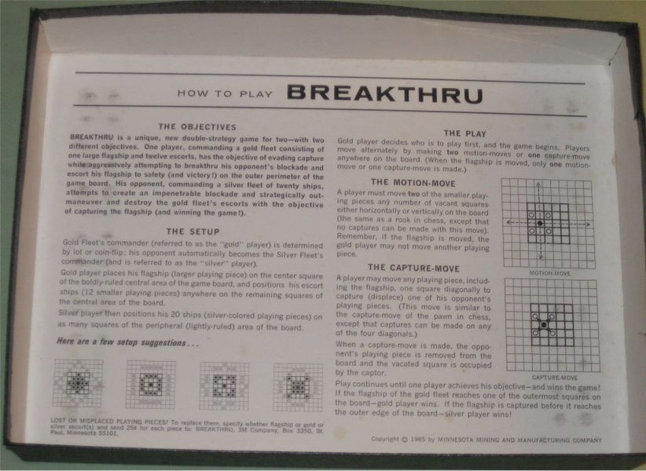

# breakthru

Game engine with AI. University project for Mark Winands, Intelligent Search & Games, 2020/21.

## Rules

Also see [Wikipedia](https://en.wikipedia.org/wiki/Breakthrough_(board_game)).

## Install

See [releases](https://github.com/davidpomerenke/breakthru/releases/tag/v1.0.0).

## Build from source & run (all platforms)

- Install the [Haskell Tool Stack](https://docs.haskellstack.org/en/stable/README/)
- `stack run` for playing games
- `stack run evaluation` to create tables and visualizations of agent evaluations

## Other projects from the course:

- [DavidSchimmel/BreakThruAI]https://github.com/DavidSchimmel/BreakThruAI
- [ZKeal/BBoardGame](https://github.com/zkeal/BBoardGame)

## See also

- [davidpomerenke/checkers](https://github.com/davidpomerenke/checkers), a similar project for the Checkers game, made with [aima.js](https://github.com/davidpomerenke/aima.js) and React
- [davidpomerenke/elm-problem-solving](ttps://github.com/davidpomerenke/elm-problem-solving), visualizations for search algorithms (forthcoming)
